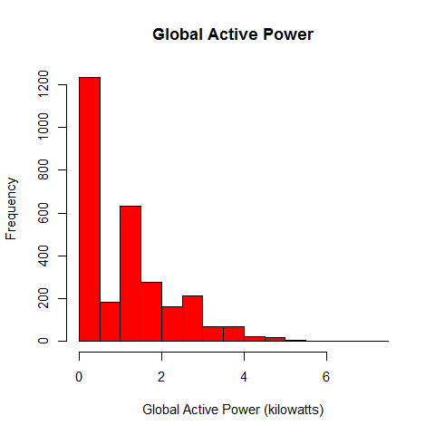
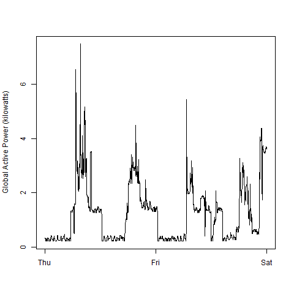
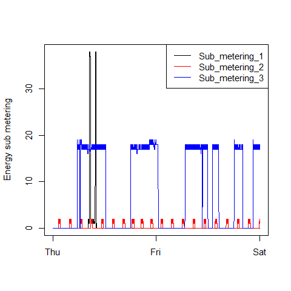
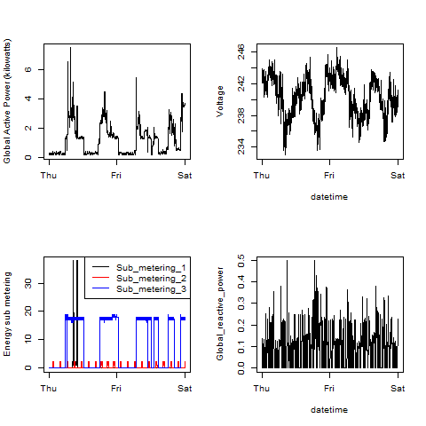

## Description

This is my submission for the Coursera Exploratory Data Analysis Course Project 1.

The files plot1.R, plot2.R, plot3.R, and plot4.R produce the output images shown below. All images are created using the png device.

The code uses the readr, dplyr, and lubridate packages.

### Plot 1

 

### Plot 2

 

### Plot 3

 

### Plot 4

 

